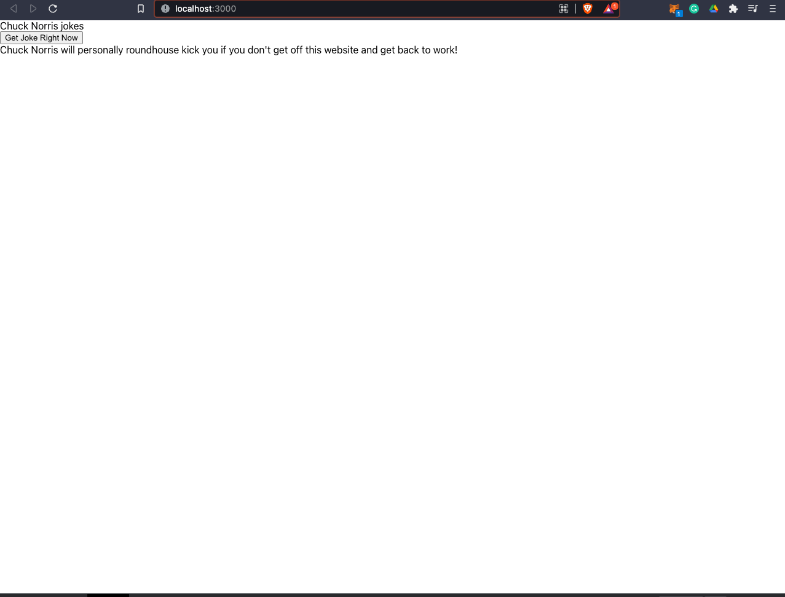

# Fetch-and-Render-Data-Exercise

The Fetch-and-Render-Data-Exercise was created for MITxPro full stack web development program.  

</a>

## Description:

 The Fetch-and-Render-Data-Exercise is built in React that calls on an API and displays the data on the screen.   
  
- This exercise is a Chuck Norris joke generator
  
- The api was was from https://api.chucknorris.io/

## Installation:

 You can replicate this project in your favorite code editor and run the program on a server. 
  

## Usage:

  
The Fetch-and-Render-Data-Exercise was built to bring joy of Chuck Norris jokes to your life.

## Roadmap:

*
 This exercise will continually be built and improved on as I learn additional skills in Javascript and React. 
*

***

**
 Future updates: 
**
- Add CSS
- Create a "load" wheel that says "Getting Joke"
- Create a random photo gen that displays with the joke.

   

## Support:

 Want to share feedback or comments?

 
  
  Reach me on *[Linkedin](https://www.linkedin.com/in/derek-diaz/)* or *[Twitter](https://twitter.com/home).*
  

